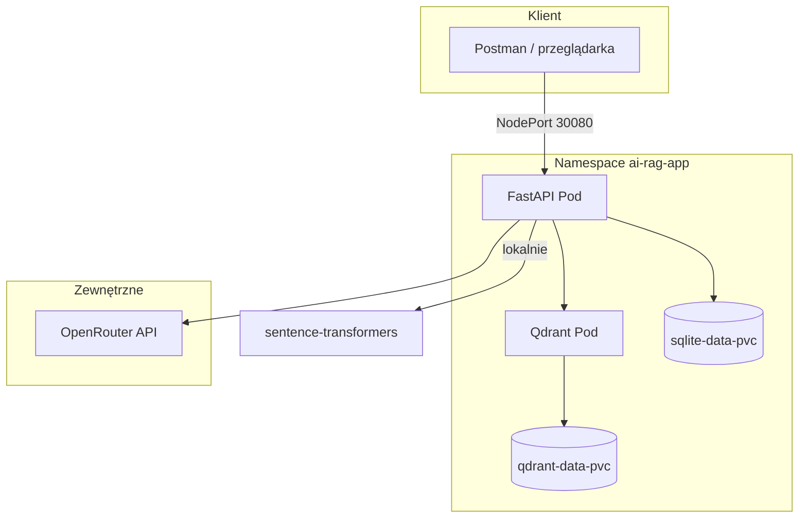
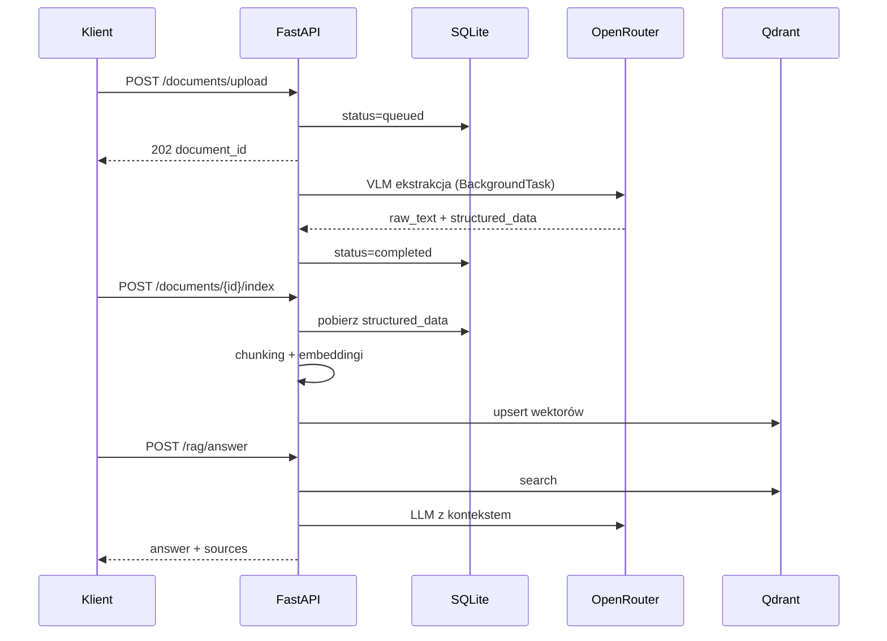
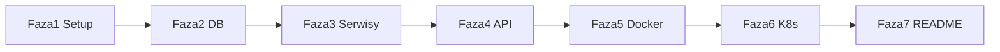

# Plan wykonania aplikacji OCR/VLM RAG API

## Stan wyjściowy

- **Dokumentacja:** kompletna w [`docs/`](docs/) — [prd.md](docs/prd.md), [db-plan.md](docs/db-plan.md), [api-plan.md](docs/api-plan.md), [k8s-plan.md](docs/k8s-plan.md), [project-structure.md](docs/project-structure.md).
- **Kod:** brak katalogu `app/`, `k8s/`, `Dockerfile` — tylko [`pyproject.toml`](pyproject.toml) z `fastapi` i pusty [`README.md`](README.md).

## Architektura docelowa





---

## Faza 1: Fundament projektu

### 1.1 Zależności (`uv add`)

| Pakiet                         | Rola                         |
| ------------------------------ | ---------------------------- |
| `fastapi`, `uvicorn[standard]` | API                          |
| `pydantic-settings`            | Konfiguracja z env           |
| `sqlmodel` (lub `sqlalchemy`)  | SQLite ORM                   |
| `qdrant-client`                | Baza wektorowa               |
| `sentence-transformers`        | Embeddingi lokalne (384 dim) |
| `httpx`                        | OpenRouter (VLM + LLM)       |
| `tenacity`                     | Retry 3x dla OpenRouter      |
| `python-multipart`             | Upload plików                |

### 1.2 Struktura katalogów

Zgodnie z [project-structure.md](docs/project-structure.md):

```
app/
  main.py, core/config.py
  api/documents.py, api/rag.py
  models/domain.py, models/schemas.py
  services/vlm_service.py, rag_service.py, background_tasks.py
  db/sqlite.py, db/qdrant.py
  utils/text_processing.py
data/.gitkeep
k8s/01-05.yaml
.env.example
Dockerfile, .dockerignore
```

### 1.3 Konfiguracja — [`app/core/config.py`](app/core/config.py)

`pydantic-settings` z polami z [k8s-plan.md](docs/k8s-plan.md) i [db-plan.md](docs/db-plan.md):

- `OPENROUTER_API_KEY`, `VLM_MODEL_NAME`, `LLM_MODEL_NAME`
- `QDRANT_HOST`, `QDRANT_PORT`, `QDRANT_COLLECTION_NAME` (domyślnie `documents_index`)
- `EMBEDDING_MODEL_NAME` (`sentence-transformers/all-MiniLM-L6-v2`)
- `SQLITE_PATH` (domyślnie `/app/data/app.db` w K8s, `./data/app.db` lokalnie)
- `UPLOAD_DIR` (np. `/app/data/uploads`)
- `CHUNK_MAX_TOKENS` (np. 400)

Plik [`.env.example`](.env.example) z opisem wszystkich zmiennych.

---

## Faza 2: Warstwa danych

### 2.1 SQLite — [`app/models/domain.py`](app/models/domain.py), [`app/db/sqlite.py`](app/db/sqlite.py)

Tabela `documents` wg [db-plan.md](docs/db-plan.md):

- `id` (UUID string, PK), `filename`, `status` (`queued` | `processing` | `completed` | `failed`)
- `raw_text`, `structured_data` (TEXT + JSON serializacja), `error_message`
- `created_at`, `updated_at`

Przy starcie aplikacji (`lifespan` w `main.py`): `create_all()` + migracja inicjalna.

### 2.2 Qdrant — [`app/db/qdrant.py`](app/db/qdrant.py)

- Klient z `QDRANT_HOST` / `QDRANT_PORT`
- Funkcja `ensure_collection()`: kolekcja `documents_index`, rozmiar wektora **384**, metryka **Cosine**
- Opcjonalnie: indeks payload `total_gross` (Float) — [db-plan.md](docs/db-plan.md)
- Helpery: `health_check()`, `upsert_chunks()`, `search(query_vector, top_k)`

---

## Faza 3: Logika biznesowa (serwisy)

### 3.1 Przetwarzanie tekstu — [`app/utils/text_processing.py`](app/utils/text_processing.py)

Z [prd.md](docs/prd.md) sekcja 4:

1. Podział `structured_data` na 3 sekcje: **header**, **items**, **summary**
2. Format Key-Value: `"Sekcja: Nagłówek. Sprzedawca: X. Nabywca: Y."`
3. Token-aware split: jeśli sekcja > `CHUNK_MAX_TOKENS` (~400), dziel na podsekcje (prosta heurystyka: liczba słów/znaków lub `tiktoken` jeśli dodane)

Payload każdego chunku: `document_id`, `section_type`, `source_text`, `filename`, `date`, `buyer`, `seller`, `currency`, `total_net`, `total_vat`, `total_gross`.

### 3.2 VLM — [`app/services/vlm_service.py`](app/services/vlm_service.py)

- OpenRouter Chat Completions z obrazem (base64 lub URL pliku)
- System prompt wymuszający **czysty JSON** z polami: `raw_text`, `structured_data` (`filename`, `date`, `buyer`, `seller`, `currency`, `total_net`, `total_vat`, `total_gross`, `items[]`)
- `@tenacity.retry(stop=stop_after_attempt(3))` na błędy sieciowe/5xx
- Parsowanie odpowiedzi; walidacja przez Pydantic schema w [`app/models/schemas.py`](app/models/schemas.py)

### 3.3 Background task — [`app/services/background_tasks.py`](app/services/background_tasks.py)

Przepływ z [db-plan.md](docs/db-plan.md):

1. `status` → `processing`
2. Wywołanie VLM
3. Sukces: zapis `raw_text`, `structured_data`, `status=completed`, **usunięcie pliku obrazu z dysku**
4. Błąd: `status=failed`, `error_message`

Użycie `FastAPI.BackgroundTasks` (nie Celery) — uzasadnienie w README.

### 3.4 RAG — [`app/services/rag_service.py`](app/services/rag_service.py)

- **Singleton** modelu embeddingów (ładowanie raz przy starcie — ważne dla limitu RAM 1Gi w K8s)
- `index_document(document_id)`: pobierz z SQLite → chunking → embed → upsert do Qdrant; zwróć `chunks_indexed`
- `search(query, top_k)`: embed zapytania → Qdrant search → mapowanie na response z [api-plan.md](docs/api-plan.md)
- `answer(question)`: search → zbuduj prompt z `source_text` chunków → OpenRouter LLM z restrykcyjnym system promptem z PRD → `{answer, sources}`

---

## Faza 4: API REST

### 4.1 Schematy Pydantic — [`app/models/schemas.py`](app/models/schemas.py)

Modele request/response 1:1 z [api-plan.md](docs/api-plan.md) (Health, UploadResponse, DocumentDetail, IndexResponse, SearchRequest/Response, AnswerRequest/Response).

### 4.2 Routery

| Plik                                           | Endpointy                                       | Kody HTTP               |
| ---------------------------------------------- | ----------------------------------------------- | ----------------------- |
| [`app/main.py`](app/main.py)                   | `GET /health`                                   | 200 / 500               |
| [`app/api/documents.py`](app/api/documents.py) | `POST /upload`, `GET /{id}`, `POST /{id}/index` | 202, 400, 404, 409, 422 |
| [`app/api/rag.py`](app/api/rag.py)             | `POST /search`, `POST /answer`                  | 200, 422, 500           |

Szczegóły kontraktów:

- **Upload:** walidacja rozszerzeń `.jpg`, `.jpeg`, `.png`; zapis do `UPLOAD_DIR`; UUID; `BackgroundTasks.add_task`
- **GET document:** `raw_text` / `structured_data` = `null` gdy status ≠ `completed`
- **Index:** `409` jeśli `status != completed`
- **Search:** `top_k` opcjonalne, domyślnie 3

Globalna obsługa błędów w `main.py` (opcjonalnie custom exception handlers dla spójnych komunikatów).

---

## Faza 5: Konteneryzacja

### 5.1 Dockerfile

Wieloetapowy lub single-stage z Python 3.12:

- `uv sync --frozen` (prod deps)
- Pre-cache modelu embeddingów w buildzie **opcjonalnie** (przyspiesza start, zwiększa obraz) — dla słabszego PC można ładować przy pierwszym żądaniu
- `WORKDIR /app`, `EXPOSE 8000`
- CMD: `uvicorn app.main:app --host 0.0.0.0 --port 8000`
- Volume mount: `/app/data`

### 5.2 `.dockerignore`

Wykluczyć `.venv`, `docs`, `k8s`, `__pycache__`, `.git`.

---

## Faza 6: Kubernetes

Manifesty wg [k8s-plan.md](docs/k8s-plan.md) w [`k8s/`](k8s/):

| Plik                | Zasoby                                                                                                                                          |
| ------------------- | ----------------------------------------------------------------------------------------------------------------------------------------------- |
| `01-namespace.yaml` | `ai-rag-app`                                                                                                                                    |
| `02-config.yaml`    | ConfigMap `app-config` + Secret `app-secrets` (OPENROUTER_API_KEY base64)                                                                       |
| `03-storage.yaml`   | PVC `sqlite-data-pvc` (1Gi), `qdrant-data-pvc` (2Gi)                                                                                            |
| `04-qdrant.yaml`    | Deployment + Service ClusterIP :6333, limity RAM/CPU                                                                                            |
| `05-api.yaml`       | Deployment `ocr-rag-api:latest`, `imagePullPolicy: Never`, env z CM/Secret, mount PVC `/app/data`, probes `/health`, Service NodePort **30080** |

Kolejność wdrożenia: 01 → 05 (jak w dokumentacji).

---

## Faza 7: README i weryfikacja

Rozbudowa [`README.md`](README.md) wg [prd.md](docs/prd.md) §8:

1. Build: `docker build -t ocr-rag-api:latest .`
2. Deploy: `kubectl apply -f k8s/...` (kolejność)
3. Test: `http://localhost:30080/health`, flow upload → poll status → index → search/answer
4. Uzasadnienie BackgroundTasks vs Celery
5. Odpowiedzi teoretyczne: Dockerfile, `.dockerignore`, docker context, warstwy obrazu, optymalizacja buildu, kolejność instrukcji Dockerfile

### Scenariusz testowy (manualny)

```text
1. POST /documents/upload  (obraz faktury)
2. GET  /documents/{id}    (poll aż status=completed)
3. POST /documents/{id}/index
4. POST /rag/search        {"query": "...", "top_k": 5}
5. POST /rag/answer        {"question": "..."}
```

---

## Kolejność implementacji (zależności)



Wewnątrz Fazy 3 sugerowana kolejność plików: `text_processing` → `vlm_service` → `background_tasks` → `rag_service`.

---

## Decyzje techniczne (domyślne)

| Temat              | Wybór                                                    | Uzasadnienie                                    |
| ------------------ | -------------------------------------------------------- | ----------------------------------------------- |
| ORM                | **SQLModel**                                             | Integracja Pydantic + SQLAlchemy, zgodne z docs |
| ID punktów Qdrant  | UUID string per chunk                                    | Unikalność przy re-indeksacji                   |
| Re-indeksacja      | Usuń stare punkty `document_id` przed upsert             | Uniknięcie duplikatów                           |
| Dev lokalny        | `uv run uvicorn` + Qdrant w Docker Compose (opcjonalnie) | Szybszy development bez pełnego K8s             |
| Testy automatyczne | Poza zakresem PRD                                        | Można dodać później na życzenie                 |

---

## Ryzyka i mitigacje

- **RAM 1Gi w K8s:** model MiniLM ~80MB + FastAPI; unikać ładowania wielu modeli; lazy load tylko jeśli konieczne.
- **Pierwszy start wolny:** sentence-transformers pobiera wagi — rozważyć warmup w `lifespan`.
- **OpenRouter JSON:** wymusić `response_format` / instrukcję „tylko JSON”; fallback regex na JSON w odpowiedzi.
- **Secret w repo:** nigdy nie commitować prawdziwego klucza — tylko placeholder w `02-config.yaml` + instrukcja `kubectl create secret`.
