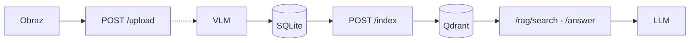

# OCR/VLM RAG API

Aplikacja zaliczeniowa na przedmiot SGGW Wdrażanie rozwiązań AI.
Skrócony opis:

- aplikacja REST API (FastAPI)
- walidacja Pydantic
- obsługa uploadu plików graficznych .jpg/.jpeg/.png
- ekstrakcja danych z plików z użyciem VLM (domyślnie GPT-4o-mini poprzez OpenRouter)
- embedding z użyciem sentence-transformers/all-MiniLM-L6-v2 i zapis do bazy wektorowej Qdrant
- wyszukiwanie w bazie wektorowej + na podstawie numeru faktury (z użyciem regex) oraz odpowiedzi LLM wraz z podaniem źródeł
- obsługa statusów HTTP
- możliwość uruchomienia lokalnie, z użyciem obrazu docker lub Kubernetes
- wszystkie ustawienia w .env (należy utworzyć na podstawie .env.example)
- obsługa zadań w tle poprzez BackgroundTasks
- zbiór faktur testowych: [Invoices donut dataset](https://huggingface.co/datasets/katanaml-org/invoices-donut-data-v1)

Szczegóły architektury, diagramy przepływów, Pydantic i JSON z VLM: **[docs/architektura.md](docs/architektura.md)**.

---

## Wymagania

- Python 3.12+, [uv](https://docs.astral.sh/uv/)
- Działający **Qdrant** (lokalnie, np. Docker: `docker run -p 6333:6333 qdrant/qdrant`)
- Klucz **OpenRouter** w `.env` (VLM + LLM) — wzór: [.env.example](.env.example); modele: [architektura.md — Modele OpenRouter](docs/architektura.md#modele-openrouter)
- **Kubernetes (ocena 5+):** Docker Desktop z włączonym K8s, `kubectl` — patrz sekcja [Kubernetes](#kubernetes-docker-desktop)

---

## Uruchomienie lokalne (dev)

```bash
cp .env.example .env
# uzupełnij OPENROUTER_API_KEY

uv sync
# baza Qdrant musi być najpierw uruchomiona
uv run uvicorn app.main:app --reload --host 0.0.0.0 --port 8000
```

- Swagger: http://localhost:8000/docs
- Health: http://localhost:8000/health
- Qdrant: http://localhost:6333/dashboard

W K8s ścieżki danych to `/app/data` (PVC); lokalnie domyślnie `./data/` (SQLite, uploady).

### Endpointy API (skrót)

| Metoda | Ścieżka                          | Opis                                       |
| ------ | -------------------------------- | ------------------------------------------ |
| `GET`  | `/health`                        | SQLite + Qdrant                            |
| `POST` | `/documents/upload`              | Obraz → VLM w tle (202)                    |
| `GET`  | `/documents/{document_id}`       | Status i dane po VLM                       |
| `POST` | `/documents/{document_id}/index` | Jeden dokument → Qdrant                    |
| `POST` | `/documents/index-all`           | Wszystkie `completed` → Qdrant w tle (202) |
| `POST` | `/rag/search`                    | Wyszukiwanie semantyczne                   |
| `POST` | `/rag/answer`                    | RAG + LLM (OpenRouter)                     |

### Statusy dokumentu (`GET /documents/{document_id}`)

| Status | Znaczenie |
| --- | --- |
| `queued` | Plik przyjęty, VLM w kolejce (BackgroundTasks) |
| `processing` | Trwa ekstrakcja VLM |
| `completed` | `raw_text` + `structured_data` dostępne w odpowiedzi |
| `failed` | Błąd VLM — pole `error_message` |

### Kody HTTP (wybrane)

| Kod | Kiedy |
| --- | --- |
| **200** | Poprawne GET, index, search, answer; health OK; `index-all` bez dokumentów `completed` |
| **202** | Upload przyjęty; `index-all` zakolejkowany |
| **400** | Zły plik uploadu (format, rozmiar) |
| **404** | Brak `document_id` |
| **409** | Indeks przed zakończeniem VLM (`status` ≠ `completed`) |
| **422** | Niepoprawne body (Pydantic), puste `question` w `/rag/answer` |
| **500** | Błąd VLM/index/search/answer; health gdy SQLite lub Qdrant niedostępne |

### Architektura (skrót)



Diagramy warstw, upload, indeks i RAG (osobne, czytelne schematy): **[docs/architektura.md](docs/architektura.md)**.

### Scenariusz testowy (E2E) — jedna faktura

1. `POST /documents/upload` — plik `.jpg` / `.png`
2. `GET /documents/{document_id}` — poll aż `status: completed`
3. `POST /documents/{document_id}/index` — wektory w Qdrant (200, `chunks_indexed`)
4. `POST /rag/search` — body: `{"query": "..."}` (opcjonalnie `"top_k"`; bez niego lub `"top_k": 0` → `RAG_DEFAULT_TOP_K` z `.env`, np. `6`)
5. `POST /rag/answer` — body: `{"question": "..."}` (opcjonalnie `"top_k"`; jak wyżej)

**Przykładowe zapytania** (po angielsku — faktury testowe z datasetu są angielskie; pytania po polsku też działają):

| `/rag/search` — `query` | `/rag/answer` — `question` |
| --- | --- |
| `Who is the seller?` | `What is the invoice number?` |
| `total gross amount` | `What is the total gross amount?` |
| `invoice INV-2024-001` | `List products on this invoice` |
| `buyer name` | `What is the VAT amount?` |

### Wiele faktur (bez ręcznego `document_id`)

1. Wgraj wiele plików (`POST /documents/upload` × N).
2. Poczekaj, aż wszystkie mają `status: completed` (GET per id lub logi VLM).
3. **`POST /documents/index-all`** — indeksuje **wszystkie** dokumenty ze statusem `completed` w tle.
   - **202** — zwraca `documents_queued` i listę `document_ids` (snapshot w momencie wywołania).
   - Postęp w logach: `Bulk index finished: X indexed, Y failed`.
   - **200** z pustą listą — brak `completed` do indeksacji.
4. `POST /rag/search` / `POST /rag/answer` — zapytania po całej kolekcji w Qdrant.

Pojedynczy dokument nadal można zindeksować przez `POST /documents/{document_id}/index` (np. re-indeksacja po zmianie chunkingu).

Przy `--reload` zadania w tle (VLM, bulk index) mogą się urwać — na E2E i przy `index-all` **lepiej bez** `--reload`.

---

## Docker

Obraz API: **`ocr-rag-api:latest`**, port **8000**, dane w kontenerze pod **`/app/data`** (`SQLITE_PATH`, `UPLOAD_DIR` ustawione w Dockerfile).

- **PyTorch CPU-only** — w `pyproject.toml` jawna zależność `torch` ze źródła [pytorch.org/whl/cpu](https://download.pytorch.org/whl/cpu) (`uv.lock` bez pakietów `nvidia-*`); podczas builda asercja `torch.version.cuda is None`.
- **Pre-cache** modelu z `EMBEDDING_MODEL_NAME` (domyślnie `all-MiniLM-L6-v2`) w warstwie obrazu — szybszy start bez pobierania wag przy pierwszym żądaniu.
- **Qdrant** nie jest w tym obrazie — osobno (Docker lub manifest `04-qdrant.yaml` w K8s).

### Pobranie z Docker Hub (bez lokalnego buildu)

Gotowy obraz: **[`tomaszwolk/ocr-rag-api`](https://hub.docker.com/r/tomaszwolk/ocr-rag-api)** na Docker Hub.

```bash
docker pull tomaszwolk/ocr-rag-api:latest
```

### Build (lokalnie)

```bash
docker build -t ocr-rag-api:latest .
```

Opcjonalnie inny model embeddingów przy buildzie:

```bash
docker build -t ocr-rag-api:latest --build-arg EMBEDDING_MODEL_NAME=sentence-transformers/all-MiniLM-L6-v2 .
```

Orientacyjny rozmiar obrazu: **~2–3 GB** (głównie PyTorch CPU + zależności; pre-cache MiniLM to ok. **+80–120 MB**).

### Run (test bez Kubernetes)

1. Qdrant (jeśli nie działa):

```bash
docker run -d --name qdrant -p 6333:6333 qdrant/qdrant:latest
```

2. API (zmienne z `.env`; na Docker Desktop host Qdrant = `host.docker.internal`):

```bash
docker run --rm -p 8000:8000 \
  --env-file .env \
  -e QDRANT_HOST=host.docker.internal \
  -e SQLITE_PATH=/app/data/app.db \
  -e UPLOAD_DIR=/app/data/uploads \
  -v "$(pwd)/data:/app/data" \
  ocr-rag-api:latest
```

- Health: http://localhost:8000/health
- Swagger: http://localhost:8000/docs
- Qdrant: http://localhost:6333/dashboard

Przy pierwszym starcie kontenera inicjalizacja kolekcji Qdrant i embeddera może zająć **1–2 min** (probe w Dockerfile ma `start-period=180s`).

### Dockerfile, warstwy i `.dockerignore`

Wymagania zaliczeniowe — krótko, w kontekście tego repozytorium:

| Pojęcie | W tym projekcie |
| --- | --- |
| **Dockerfile** | Multi-stage: builder (`uv sync`, pre-cache MiniLM, CPU-only PyTorch) → runtime (`python:3.12-slim`, tylko `/app`) |
| **`.dockerignore`** | Wyklucza m.in. `.venv`, `data/`, `docs/`, `k8s/`, `.env`, `.git` — mniejszy **context**, szybszy build, brak sekretów w obrazie |
| **Context** | Katalog z Dockerfile; do demona trafia tylko to, co nie jest w `.dockerignore` |
| **Warstwy / cache** | Najpierw `pyproject.toml` + `uv.lock` + `uv sync`, potem `COPY app` — zmiana kodu nie przebudowuje PyTorch |
| **Kolejność instrukcji** | Zależności przed kodem aplikacji → cache przy codziennych zmianach w `app/` |

### Pytania teoretyczne — Docker (rozszerzenie)

**Dockerfile** — instrukcje budowy niezmiennego obrazu (`FROM`, `RUN`, `COPY`, `CMD`). `docker build` wykonuje kroki warstwa po warstwie.

**`.dockerignore`** — jak `.gitignore` dla wysyłanego kontekstu buildu.

**Docker context** — pliki przekazane daemonowi; tylko one mogą wejść do `COPY`.

**Warstwy** — każdy krok Dockerfile = cache’owana warstwa; zmiana wcześniejszej unieważnia późniejsze.

**Optymalizacja** — rzadkie kroki na górę, `.dockerignore`, multi-stage, łączenie `RUN` tam, gdzie sensowne.

**Kolejność instrukcji** — przy zmianie tylko kodu nie przebudowujesz instalacji zależności.

---

## Kubernetes (Docker Desktop)

Wariant **wdrożeniowy na ocenę 5+** (obok wymaganego Dockera): osobne deploymenty API i Qdrant, manifesty YAML, ConfigMap/Secret z `.env`, health checki, opis uruchomienia lokalnego klastra.

Manifesty: `k8s/01`–`04`, skrypt [`scripts/deploy-k8s.sh`](scripts/deploy-k8s.sh), namespace **`ai-rag-app`**. Skrót plików: [k8s/README.md](k8s/README.md).

### Wymagania

- Kubernetes w Docker Desktop, `kubectl`, `docker`, plik **`.env`** (jak do dev — ten sam plik).
- Orientacyjnie **~4 GB wolnego RAM** (API + Qdrant + embedder). Brak sztywnych `resources.limits` w YAML.

### Jedna komenda (zalecane)

```bash
chmod +x scripts/deploy-k8s.sh   # raz, Git Bash / Linux / macOS
./scripts/deploy-k8s.sh
```

Skrypt:

1. Tworzy **ConfigMap** z `.env` (wszystko oprócz `OPENROUTER_API_KEY`) z nadpisaniem na K8s: `QDRANT_HOST=qdrant-service`, `SQLITE_PATH=/app/data/app.db`, `UPLOAD_DIR=/app/data/uploads`.
2. Tworzy **Secret** tylko z `OPENROUTER_API_KEY`.
3. Stosuje manifesty i czeka na rollout.
4. Domyślnie używa obrazu **[`tomaszwolk/ocr-rag-api:latest`](https://hub.docker.com/r/tomaszwolk/ocr-rag-api)** (`imagePullPolicy: IfNotPresent` — pobranie z Hub, gdy brak obrazu na węźle).

**Zmiana modelu VLM/LLM w `.env`** → ponownie `./scripts/deploy-k8s.sh` (odświeży ConfigMap i zrestartuje API).

| Flaga     | Działanie                                                                     |
| --------- | ----------------------------------------------------------------------------- |
| _(brak)_  | Obraz z Docker Hub                                                            |
| `--local` | `docker build` (jeśli brak obrazu), import do węzła K8s, `ocr-rag-api:latest` |
| `--build` | Jak `--local`, zawsze przebudowuje obraz                                      |

### Dostęp z hosta

Service typu **LoadBalancer** na porcie **8000** (ten sam co lokalny `uvicorn` / `docker run -p 8000:8000`). Docker Desktop mapuje to na `http://localhost:8000`.

| URL                          | Opis            |
| ---------------------------- | --------------- |
| http://localhost:8000/health | SQLite + Qdrant |
| http://localhost:8000/docs   | Swagger         |

Pierwszy start API: **2–4 min** (startupProbe, ładowanie embeddera).

```bash
kubectl get pods -n ai-rag-app -w
kubectl logs -n ai-rag-app -l app=api -f
```

### Test E2E w klastrze

Upload → `completed` → index → search/answer pod `http://localhost:8000`.

**Uwaga:** restart poda API przerywa `BackgroundTasks` (VLM, `/index-all`). Dane w klastrze są na **PVC**.

### Rozwiązywanie problemów

| Objaw                            | Co zrobić                                                              |
| -------------------------------- | ---------------------------------------------------------------------- |
| `ImagePullBackOff` / brak obrazu | Hub: sprawdź sieć; lokalnie: `./scripts/deploy-k8s.sh --local --build` |
| API nie `Ready`                  | Poczekaj do ~4 min; `kubectl logs -n ai-rag-app -l app=api`            |
| Stara konfiguracja w podzie      | Ponów `./scripts/deploy-k8s.sh` po edycji `.env`                       |

---

## Decyzje projektowe

### Dlaczego `BackgroundTasks`, a nie Celery/Redis?

|                | **FastAPI BackgroundTasks**                            | **Celery + Redis**                         |
| -------------- | ------------------------------------------------------ | ------------------------------------------ |
| Infrastruktura | Brak kolejki — ten sam proces co API                   | Osobny broker (Redis/RabbitMQ) i worker(y) |
| Złożoność      | Niska — wystarczy na VLM po uploadzie                  | Wyższa — kolejki, monitoring workerów      |
| Skalowanie     | Jedna replika API; długie VLM obciąża ten sam pod      | Wiele workerów, rozłożenie zadań           |
| Trwałość zadań | Zadanie ginie przy restarcie procesu                   | Kolejka przetrwa restart workera           |
| Ten projekt    | VLM po uploadzie + **bulk index** (`/index-all`) w tle | Przydatne przy dużym wolumenie i SLA       |

**Wniosek:** Dla zaliczenia i lokalnego K8s BackgroundTasks to świadomy trade-off: prostsze wdrożenie, mniej komponentów. Celery ma sens przy masowym OCR i oddzielnym skalowaniu workerów.

Bulk index **nie** woła w pętli wewnętrznego HTTP — ten sam kod co `/{document_id}/index` (`index_document()`), lista ID przekazana z routera do taska (jedno zapytanie do SQLite).

### Język promptów i chunków

**Prompty VLM/LLM oraz etykiety w chunkach (`Section: Header.`, `Item_name:`, …) są po angielsku** — świadoma decyzja: przykładowe faktury w bazie testowej są angielskie; planowane testy mniejszych modeli, które gorzej radzą sobie z polskim w promptach. API może przyjmować pytania po polsku — embeddingi i LLM i tak operują na angielskim kontekście z indeksu.

### SQLite vs Qdrant

- **SQLite** — stan dokumentu (`queued` → `completed`), `raw_text`, JSON `structured_data`.
- **Qdrant** — wektory chunków + payload (`document_id`, `section_type`, `source_text`, metadane faktury).
- **`document_id`** (UUID) łączy obie bazy. ID **punktu** w Qdrant: UUID5 z `APP_NAMESPACE` i klucza `{document_id}:{section_type}:{index}`.

### Indeksowanie i re-indeksacja

Przed każdym indeksem pojedynczego dokumentu: **`delete_by_document_id`**, potem batch **`upsert`**. Powód: zmienna liczba chunków `items` — bez delete zostają „zombie” punkty w Qdrant.

- **`POST /documents/{document_id}/index`** — synchronicznie, wynik od razu (`chunks_indexed`).
- **`POST /documents/index-all`** — wszystkie `completed` z SQLite; **BackgroundTasks**; odpowiedź **202** z listą ID, która zostanie zindeksowana (bez drugiego SELECT w serwisie). Błąd jednego dokumentu nie przerywa reszty (log + wpis w `failed` w logach podsumowania).

### Chunking

- **Header / summary** — zwykle jeden chunk; bez dzielenia po tokenach.
- **Items** — jeden produkt = jeden sformatowany blok; łączenie w chunki do limitu `CHUNK_MAX_TOKENS`; brak cięcia w środku produktu.
- W tekście chunka **pomijamy pola `None`** (nie wstawiamy `"None"` do embeddingów).

### Dane strukturalne z VLM

Kształt JSON (`StructuredData`), przykład i mapowanie pól: **[docs/architektura.md — JSON strukturalny](docs/architektura.md#json-strukturalny-vlm--sqlite)**. Walidacja Pydantic: **[architektura — Pydantic](docs/architektura.md#pydantic--główne-modele)**.

### RAG `/search` i `/answer`

- Domyślne **`top_k`** = **`RAG_DEFAULT_TOP_K`** z `.env` (np. `6`). Jeśli w body nie ma `top_k`, jest `null` albo **`top_k: 0`** (częste w Swagger UI) — serwer używa wartości domyślnej z konfiguracji, nie zwraca pustej listy hitów.
- **Hybrid search** (`hybrid_search`): najpierw Qdrant (`top_k`), potem opcjonalnie SQLite — gdy z zapytania wyciągnięto kandydat numeru faktury (kotwice: `faktura`, `fv`, `invoice` + token, ewentualnie fallback cyfrowy). `LIKE` na kolumnie **`structured_data`**, max **3** dokumentów **nieobecnych** w wynikach wektorowych; dopięte na końcu listy jako `section_type: sql_match`, `score: 1.0`.
- Oba endpointy zwracają **`SearchResultItem`** z **`metadata.entire_document`** (JSON z `structured_data`, `indent=2`) na każdym hicie — **`enrich_search_results_with_sqlite()`**.

### RAG `/answer` (dodatkowo)

- **`sources`** w odpowiedzi = wzbogacone wyniki search (jak `/search`).
- Kontekst LLM: **`_format_answer_context()`** — każdy hit dostarcza chunk (`source_text`); pełny JSON dokumentu tylko przy hicie z **najwyższym `score`** dla danego `document_id` (bez powtórzeń w prompcie).
- Brak wyników search → odpowiedź `"No information available"` **bez** wywołania LLM.

### Ograniczenia RAG

System **nie** wykonuje agregacji po całej bazie (np. *„która faktura ma najwyższą kwotę brutto?”* wśród wszystkich dokumentów). `/rag/search` i `/rag/answer` opierają się na **top‑k** fragmentach z Qdrant (+ opcjonalnie dopasowanie po **numerze faktury** w SQLite). Pytania wymagające globalnego porównania wszystkich faktur wymagałyby osobnej warstwy (SQL/analityka), poza scope tego API.

### VLM i LLM (OpenRouter)

- Modele: tabela w [docs/architektura.md](docs/architektura.md#modele-openrouter).
- **VLM:** `extract_structured_data()` → `VLM_MODEL_NAME`.
- **LLM:** `answer_question()` → `LLM_MODEL_NAME`.
- Retry (`tenacity`) na błędy sieciowe / rate limit — **nie** ponawiać `400` (zły schema/model).
- `response_format` bez `strict` tam, gdzie provider odrzuca schema.
- Po sukcesie VLM — **usunięcie pliku obrazu** z dysku.

### API

- Embedder (`SentenceTransformer`) i klient Qdrant — **`app.state`** w `lifespan`, używane w routerach przez `Request`.
- Qdrant search: **`query_points`** (nowsze API klienta), nie przestarzałe `search()`.

---

## Struktura repozytorium (skrót)

```
app/
  api/          documents, rag, health
  services/     vlm_service, rag_service, background_tasks
  db/           sqlite, qdrant
  utils/        text_processing, upload_validation
  models/       domain, schemas
  core/         config
data/           SQLite, uploady (lokalnie; PVC w K8s)
docs/           architektura.md (+ notatki wewnętrzne)
k8s/            manifesty YAML (01–04)
scripts/        deploy-k8s.sh
```

---
