# OCR/VLM RAG API — zaliczenie SGGW

REST API (FastAPI): upload skanów faktur → ekstrakcja VLM (OpenRouter) → indeks wektorowy (Qdrant) → wyszukiwanie i odpowiedzi RAG (lokalne embeddingi + LLM).

**Szczegółowy stan kodu:** [docs/stan-projektu.md](docs/stan-projektu.md)  
**Plany:** [docs/prd.md](docs/prd.md), [docs/api-plan.md](docs/api-plan.md), [docs/db-plan.md](docs/db-plan.md), [docs/k8s-plan.md](docs/k8s-plan.md)

---

## Wymagania

- Python 3.12+, [uv](https://docs.astral.sh/uv/)
- Działający **Qdrant** (lokalnie, np. Docker: `docker run -p 6333:6333 qdrant/qdrant`)
- Klucz **OpenRouter** w `.env` (VLM + LLM)
- Do wdrożenia K8s: Docker Desktop z Kubernetes, `kubectl`

### Wybór modeli OpenRouter (testy)

| Rola | Zmienna `.env` | Model | Uzasadnienie |
|------|----------------|-------|--------------|
| **VLM** (OCR / ekstrakcja z obrazu) | `VLM_MODEL_NAME` | `openai/gpt-4o-mini` | Tańsze modele w testach nie odczytywały wszystkich pól ze skanów faktur. |
| **LLM** (odpowiedzi RAG) | `LLM_MODEL_NAME` | `deepseek/deepseek-v4-flash` | Wystarczający do Q&A na kontekście z chunków; niski koszt. Darmowe modele na OpenRouter często były przeciążone (**503**). |

Wartości ustawiasz w `.env` (wzór: [.env.example](.env.example)).

---

## Uruchomienie lokalne (dev)

```bash
cp .env.example .env
# uzupełnij OPENROUTER_API_KEY

uv sync
uv run uvicorn app.main:app --reload --host 0.0.0.0 --port 8000
```

- Swagger: http://localhost:8000/docs  
- Health: http://localhost:8000/health  

W K8s ścieżki danych to `/app/data` (PVC); lokalnie domyślnie `./data/` (SQLite, uploady).

### Endpointy API (skrót)

| Metoda | Ścieżka | Opis |
|--------|---------|------|
| `GET` | `/health` | SQLite + Qdrant |
| `POST` | `/documents/upload` | Obraz → VLM w tle (202) |
| `GET` | `/documents/{document_id}` | Status i dane po VLM |
| `POST` | `/documents/{document_id}/index` | Jeden dokument → Qdrant |
| `POST` | `/documents/index-all` | Wszystkie `completed` → Qdrant w tle (202) |
| `POST` | `/rag/search` | Wyszukiwanie semantyczne |
| `POST` | `/rag/answer` | RAG + LLM (OpenRouter) |

### Przepływ wywołań (diagram)

Poniżej: które **funkcje** (pliki w `app/`) są wywoływane po trafieniu w dany endpoint. Strzałki `-.->` = zadanie w tle (`BackgroundTasks`).

```mermaid
flowchart TB
  subgraph START["Startup — lifespan (main.py)"]
    direction TB
    S1[init_db] --> S2["SentenceTransformer → app.state.embedder"]
    S2 --> S3["get_qdrant_client → app.state.qdrant_client"]
    S3 --> S4[ensure_collection]
  end

  subgraph HEALTH["GET /health — health.py"]
    H1[check_sqlite] --> H2[health_check_qdrant]
    H2 --> H3[HealthResponse]
  end

  subgraph UPLOAD["POST /documents/upload — documents.py"]
    U1[validate_upload_file] --> U2["SQLite: Document status=queued"]
    U2 -.-> U3[process_document_vlm]
    U3 --> U4[extract_structured_data — vlm_service]
    U4 --> U5["SQLite: raw_text, structured_data, status=completed"]
    U5 --> U6[usunięcie pliku z UPLOAD_DIR]
  end

  subgraph GETDOC["GET /documents/{id} — documents.py"]
    G1[get_document] --> G2["StructuredData.model_validate_json"]
    G2 --> G3[DocumentDetailResponse]
  end

  subgraph INDEX1["POST /documents/{id}/index — documents.py"]
    I1[index_document — rag_service] --> I2[build_chunks — text_processing]
    I2 --> I3[delete_by_document_id — qdrant]
    I3 --> I4["embedder.encode → upsert_chunks"]
  end

  subgraph INDEXALL["POST /documents/index-all — documents.py"]
    A1[list_completed_document_ids] -.-> A2[process_index_all_documents]
    A2 --> A3[index_all_completed_documents]
    A3 --> I1
  end

  subgraph SEARCH["POST /rag/search — rag.py"]
    R0[_resolve_top_k] --> R1[hybrid_search]
    R1 --> R2[search_documents]
    R2 --> R2a["embedder.encode → search_vectors — qdrant"]
    R1 --> R3[extract_invoice_number_candidates — query_parsing]
    R3 --> R4["find_completed_documents_for_invoice_candidates — sqlite"]
    R4 --> R5[_document_to_sql_search_result]
    R2 --> R6[merge vector + sql hits]
    R5 --> R6
    R6 --> R7[enrich_search_results_with_sqlite]
    R7 --> R8[SearchResponse]
  end

  subgraph ANSWER["POST /rag/answer — rag.py"]
    Q0[_resolve_top_k] --> Q1[hybrid_search]
    Q1 --> Q7[enrich_search_results_with_sqlite]
    Q7 --> Q8{wyniki puste?}
    Q8 -->|tak| Q9["No information available"]
    Q8 -->|nie| Q10[answer_question]
    Q10 --> Q11[_format_answer_context]
    Q11 --> Q12["OpenRouter chat.completions — LLM_MODEL_NAME"]
    Q12 --> Q13[AnswerResponse + sources]
  end
```



Skrót warstw: **router** (`app/api/*`) → **serwisy** (`vlm_service`, `rag_service`, `background_tasks`) → **bazy** (`sqlite`, `qdrant`) + lokalny **embedder** w `app.state`.

### Scenariusz testowy (E2E) — jedna faktura

1. `POST /documents/upload` — plik `.jpg` / `.png`
2. `GET /documents/{document_id}` — poll aż `status: completed`
3. `POST /documents/{document_id}/index` — wektory w Qdrant (200, `chunks_indexed`)
4. `POST /rag/search` — body: `{"query": "..."}` (opcjonalnie `"top_k"`; bez niego lub `"top_k": 0` → `RAG_DEFAULT_TOP_K` z `.env`, np. `6`)
5. `POST /rag/answer` — body: `{"question": "..."}` (opcjonalnie `"top_k"`; jak wyżej)

### Wiele faktur (bez ręcznego `document_id`)

1. Wgraj wiele plików (`POST /documents/upload` × N).
2. Poczekaj, aż wszystkie mają `status: completed` (GET per id lub logi VLM).
3. **`POST /documents/index-all`** — indeksuje **wszystkie** dokumenty ze statusem `completed` w tle.
   - **202** — zwraca `documents_queued` i listę `document_ids` (snapshot w momencie wywołania).
   - Postęp w logach: `Bulk index finished: X indexed, Y failed`.
   - **200** z pustą listą — brak `completed` do indeksacji.
4. `POST /rag/search` / `POST /rag/answer` — zapytania po całej kolekcji w Qdrant.

Pojedynczy dokument nadal można zindeksować przez `POST /documents/{document_id}/index` (np. re-indeksacja po zmianie chunkingu).

Przy `--reload` zadania w tle (VLM, bulk index) mogą się urwać — na E2E i przy `index-all` **lepiej bez** `--reload`.

---

## Docker (do uzupełnienia po dodaniu Dockerfile)

> Po utworzeniu `Dockerfile` i `.dockerignore` uzupełnij tę sekcję konkretnymi komendami z Twojego pliku.

```bash
docker build -t ocr-rag-api:latest .
```

Obraz docelowy: `ocr-rag-api:latest`, port **8000**, wolumen na dane: `/app/data`.

---

## Kubernetes (do uzupełnienia po dodaniu `k8s/`)

> Manifesty wg [docs/k8s-plan.md](docs/k8s-plan.md), namespace `ai-rag-app`.

Kolejność:

```bash
kubectl apply -f k8s/01-namespace.yaml
kubectl apply -f k8s/02-config.yaml
kubectl apply -f k8s/03-storage.yaml
kubectl apply -f k8s/04-qdrant.yaml
kubectl apply -f k8s/05-api.yaml
```

API z hosta (Docker Desktop): http://localhost:30080/health  

Secret `OPENROUTER_API_KEY` — w manifeście Base64 lub `kubectl create secret` (nie commituj prawdziwego klucza).

---

## Dlaczego `BackgroundTasks`, a nie Celery/Redis?

| | **FastAPI BackgroundTasks** | **Celery + Redis** |
|---|---------------------------|-------------------|
| Infrastruktura | Brak kolejki — ten sam proces co API | Osobny broker (Redis/RabbitMQ) i worker(y) |
| Złożoność | Niska — wystarczy na VLM po uploadzie | Wyższa — kolejki, monitoring workerów |
| Skalowanie | Jedna replika API; długie VLM obciąża ten sam pod | Wiele workerów, rozłożenie zadań |
| Trwałość zadań | Zadanie ginie przy restarcie procesu | Kolejka przetrwa restart workera |
| Ten projekt | VLM po uploadzie + **bulk index** (`/index-all`) w tle | Przydatne przy dużym wolumenie i SLA |

**Wniosek:** Dla zaliczenia i lokalnego K8s BackgroundTasks to świadomy trade-off: prostsze wdrożenie, mniej komponentów. Celery ma sens przy masowym OCR i oddzielnym skalowaniu workerów.

Bulk index **nie** woła w pętli wewnętrznego HTTP — ten sam kod co `/{document_id}/index` (`index_document()`), lista ID przekazana z routera do taska (jedno zapytanie do SQLite).

---

## Decyzje projektowe (pamiętaj przy obronie / rozwoju)

### Język promptów i chunków

**Prompty VLM/LLM oraz etykiety w chunkach (`Section: Header.`, `Item_name:`, …) są po angielsku** — świadoma decyzja: przykładowe faktury w bazie testowej są angielskie; planowane testy mniejszych modeli, które gorzej radzą sobie z polskim w promptach. API może przyjmować pytania po polsku — embeddingi i LLM i tak operują na angielskim kontekście z indeksu.

### SQLite vs Qdrant

- **SQLite** — stan dokumentu (`queued` → `completed`), `raw_text`, JSON `structured_data`.
- **Qdrant** — wektory chunków + payload (`document_id`, `section_type`, `source_text`, metadane faktury).
- **`document_id`** (UUID) łączy obie bazy. ID **punktu** w Qdrant: UUID5 z `APP_NAMESPACE` i klucza `{document_id}:{section_type}:{index}`.

### Indeksowanie i re-indeksacja

Przed każdym indeksem pojedynczego dokumentu: **`delete_by_document_id`**, potem batch **`upsert`**. Powód: zmienna liczba chunków `items` — bez delete zostają „zombie” punkty w Qdrant.

- **`POST /documents/{document_id}/index`** — synchronicznie, wynik od razu (`chunks_indexed`).
- **`POST /documents/index-all`** — wszystkie `completed` z SQLite; **BackgroundTasks**; odpowiedź **202** z listą ID, która zostanie zindeksowana (bez drugiego SELECT w serwisie). Błąd jednego dokumentu nie przerywa reszty (log + wpis w `failed` w logach podsumowania).

### Chunking

- **Header / summary** — zwykle jeden chunk; bez dzielenia po tokenach.
- **Items** — jeden produkt = jeden sformatowany blok; łączenie w chunki do limitu `CHUNK_MAX_TOKENS`; brak cięcia w środku produktu.
- W tekście chunka **pomijamy pola `None`** (nie wstawiamy `"None"` do embeddingów).

### Pola faktury

- W JSON z VLM: **`invoice_no`** (nie mylić z nazwą pliku).
- **`Document.filename`** w SQLite = nazwa z uploadu; to samo w payloadzie Qdrant jako **`filename`**.
- Pozycje: **`total_line_net`**, **`total_line_gross`**.

### RAG `/search` i `/answer`

- Domyślne **`top_k`** = **`RAG_DEFAULT_TOP_K`** z `.env` (np. `6`). Jeśli w body nie ma `top_k`, jest `null` albo **`top_k: 0`** (częste w Swagger UI) — serwer używa wartości domyślnej z konfiguracji, nie zwraca pustej listy hitów.
- **Hybrid search** (`hybrid_search`): najpierw Qdrant (`top_k`), potem opcjonalnie SQLite — gdy z zapytania wyciągnięto kandydat numeru faktury (kotwice: `faktura`, `fv`, `invoice` + token, ewentualnie fallback cyfrowy). `LIKE` na kolumnie **`structured_data`**, max **3** dokumentów **nieobecnych** w wynikach wektorowych; dopięte na końcu listy jako `section_type: sql_match`, `score: 1.0`.
- Oba endpointy zwracają **`SearchResultItem`** z **`metadata.entire_document`** (JSON z `structured_data`, `indent=2`) na każdym hicie — **`enrich_search_results_with_sqlite()`**.

### RAG `/answer` (dodatkowo)

- **`sources`** w odpowiedzi = wzbogacone wyniki search (jak `/search`).
- Kontekst LLM: **`_format_answer_context()`** — każdy hit dostarcza chunk (`source_text`); pełny JSON dokumentu tylko przy hicie z **najwyższym `score`** dla danego `document_id` (bez powtórzeń w prompcie).
- Brak wyników search → odpowiedź `"No information available"` **bez** wywołania LLM.

### VLM i LLM (OpenRouter)

- **VLM:** `extract_structured_data()` → model z `VLM_MODEL_NAME` (rekomendacja: **`openai/gpt-4o-mini`**).
- **LLM:** `answer_question()` → model z `LLM_MODEL_NAME` (rekomendacja: **`deepseek/deepseek-v4-flash`**).
- Retry (`tenacity`) na błędy sieciowe / rate limit — **nie** ponawiać `400` (zły schema/model).
- `response_format` bez `strict` tam, gdzie provider odrzuca schema.
- Po sukcesie VLM — **usunięcie pliku obrazu** z dysku.

### API

- Embedder (`SentenceTransformer`) i klient Qdrant — **`app.state`** w `lifespan`, używane w routerach przez `Request`.
- Qdrant search: **`query_points`** (nowsze API klienta), nie przestarzałe `search()`.

---

## Pytania teoretyczne — Docker (wymaganie zaliczenia)

### Czym jest Dockerfile?

Plik tekstowy z instrukcjami budowy **obrazu** kontenera (bazowy obraz, instalacja zależności, kopiowanie kodu, `CMD`/`ENTRYPOINT`). `docker build` wykonuje te kroki i tworzy niezmienną „matrycę” do uruchamiania kontenerów.

### Czym jest `.dockerignore`?

Odpowiednik `.gitignore` dla **kontekstu buildu** — pliki/katalogi nie trafiają do demona Dockera przy `docker build`. Mniejszy kontekst = szybszy build i brak sekretów / `.venv` w obrazie.

### Czym jest docker context?

Zestaw plików wysyłanych do Dockera podczas buildu (zwykle katalog z Dockerfile + `.dockerignore`). Tylko to, co w kontekście, może być skopiowane instrukcją `COPY`.

### Jak działają warstwy obrazu (image layers)?

Każda instrukcja Dockerfile (RUN, COPY, …) tworzy **warstwę** (cache’owaną). Warstwy są tylko do odczytu i współdzielone między obrazami. Zmiana wczesnej warstwy unieważnia cache późniejszych kroków.

### Jak zoptymalizować czas budowy obrazu?

- Rzadko zmieniane kroki **na górę** (baza, `uv sync` / instalacja zależności).
- Kod aplikacji **`COPY` na dół**.
- `.dockerignore` (bez `.venv`, `docs`, `.git`).
- Łączenie RUN w jedną warstwę tam, gdzie ma sens.
- Multi-stage build (build deps vs runtime) — mniejszy finalny obraz.

### Dlaczego kolejność instrukcji w Dockerfile ma znaczenie?

Bo **cache warstw** — jeśli zmienisz plik źródłowy, warstwa `COPY` i wszystko po niej buduje się od nowa. Gdy zależności są zainstalowane wcześniej, przy zmianie tylko kodu nie pobierasz ponownie całego PyTorch/sentence-transformers.

---

## Struktura repozytorium (skrót)

```
app/
  api/          documents, rag, health
  services/     vlm_service, rag_service, background_tasks
  db/           sqlite, qdrant
  utils/        text_processing, upload_validation
  models/       domain, schemas
  core/         config
data/           SQLite, uploady (lokalnie; PVC w K8s)
docs/           plany i stan-projektu.md
k8s/            (do dodania) manifesty YAML
```

---

## Co jeszcze zrobić przed oddaniem

- [x] API dokumentów + RAG (`/index-all` w tym)
- [ ] `Dockerfile` + `.dockerignore` → uzupełnij sekcję Docker powyżej
- [ ] `k8s/01`–`05` → uzupełnij sekcję Kubernetes
- [ ] Test na klastrze: `http://localhost:30080/health` + flow E2E (upload × N → `index-all` → search/answer)
