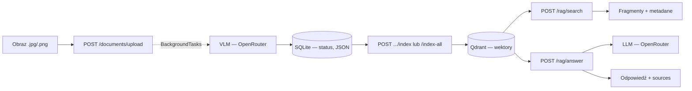
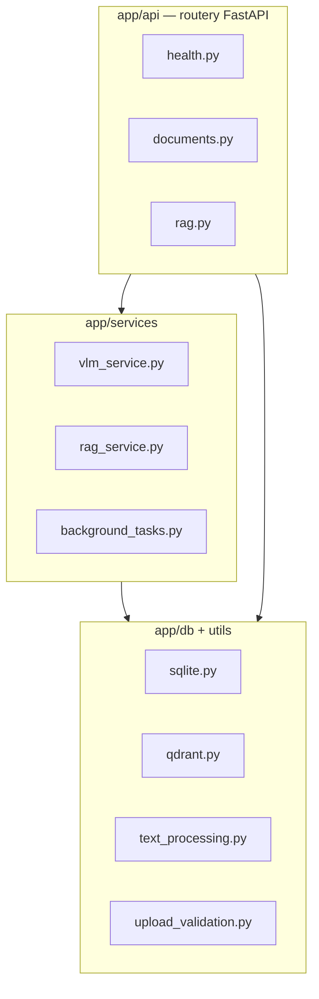
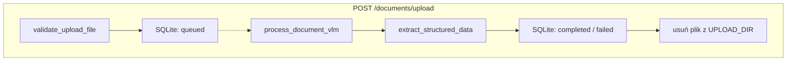
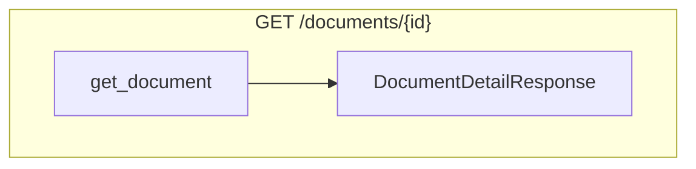
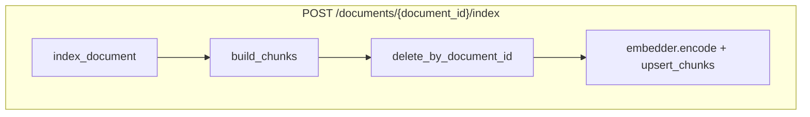
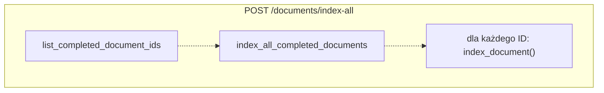
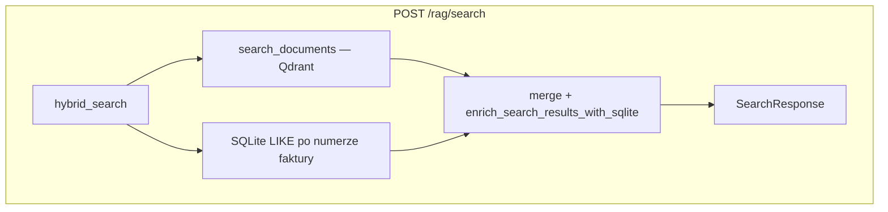
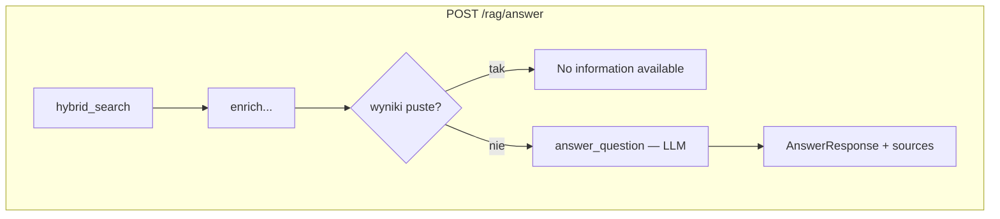

# Architektura — OCR/VLM RAG API

Dokument uzupełnia [README.md](../README.md): przepływy, schematy Pydantic i szczegóły implementacji. Nie zastępuje instrukcji uruchomienia.

---

## Przepływ end-to-end (poziom systemu)

Jeden diagram „od pliku do odpowiedzi” — czytelny na pierwszy rzut oka:



**Startup** (przed ruchem API): `init_db` → `SentenceTransformer` w `app.state.embedder` → klient Qdrant + `ensure_collection` (`app/main.py` lifespan).

---

## Warstwy kodu



Walidacja wejścia i kształty odpowiedzi: **`app/models/schemas.py`** (Pydantic). Encja dokumentu w bazie: **`app/models/domain.py`** (SQLModel).

---

## Dokumenty — upload, status, indeks







`POST /documents/index-all` — ten sam łańcuch co wyżej (`index_document`), wywoływany w pętli w tle:



Statusy dokumentu (`DocumentStatus`): `queued` → `processing` → `completed` lub `failed`.

---

## RAG — wyszukiwanie i odpowiedź





---

## Pydantic — główne modele

| Model                                                 | Rola                 |
| ----------------------------------------------------- | -------------------- |
| `StructuredData`, `InvoiceItem`                       | JSON z VLM (faktura) |
| `UploadResponse`, `DocumentDetailResponse`            | Upload i status      |
| `IndexResponse`, `BulkIndexResponse`                  | Indeksowanie         |
| `SearchRequest`, `SearchResponse`, `SearchResultItem` | `/rag/search`        |
| `AnswerRequest`, `AnswerResponse`                     | `/rag/answer`        |
| `HealthResponse`                                      | `/health`            |

FastAPI automatycznie zwraca **422** przy niepoprawnym body (np. brak pola `query`). Upload zły format pliku → **400** (`validate_upload_file`).

Szczegóły pól: `app/models/schemas.py`.

---

## JSON strukturalny (VLM → SQLite)

Wynik ekstrakcji to `StructuredData` (zapisany jako JSON w kolumnie `structured_data`). Przykładowy kształt:

```json
{
  "invoice_no": "INV-2024-001",
  "date": "2024-03-15",
  "buyer": "Acme Corp",
  "seller": "Supplier Ltd",
  "currency": "USD",
  "total_net": 1000.0,
  "total_vat": 230.0,
  "total_gross": 1230.0,
  "items": [
    {
      "item_name": "Widget A",
      "quantity": 2,
      "unit_price": 500.0,
      "total_line_net": 1000.0,
      "total_line_gross": 1230.0
    }
  ]
}
```

Pola opcjonalne (`null` w JSON) — w chunkach do embeddingu **pomijane**, pełny audyt przez `GET /documents/{document_id}`.

Dodatkowo w SQLite: `raw_text` (tekst z VLM), `filename` (nazwa pliku z uploadu). W Qdrant w payloadzie m.in. `filename`, `section_type`, `source_text`.

---

## Modele OpenRouter

| Rola                   | Zmienna `.env`   | Model (testy)                | Uwagi                                           |
| ---------------------- | ---------------- | ---------------------------- | ----------------------------------------------- |
| VLM (OCR / ekstrakcja) | `VLM_MODEL_NAME` | `openai/gpt-4o-mini`         | Tańsze modele gorzej wypełniały pola na skanach |
| LLM (RAG answer)       | `LLM_MODEL_NAME` | `deepseek/deepseek-v4-flash` | Q&A na kontekście chunków; niski koszt          |

Wartości w `.env` / `.env.example`.
